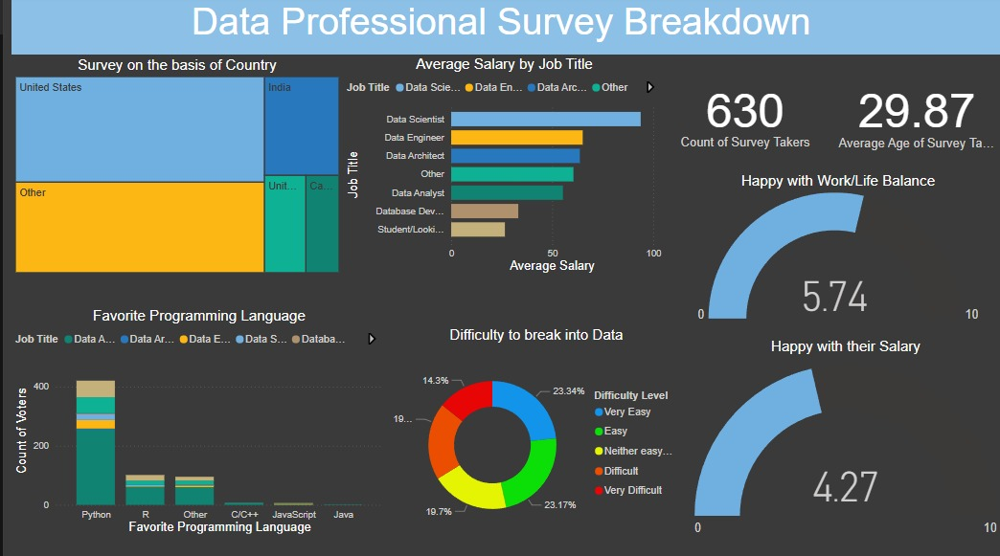

#  Data Professional Survey Breakdown – Power BI Project

This Power BI project visualizes insights from a survey conducted among **630+ data professionals** across the globe. It dives into key aspects such as job roles, salary trends, favorite programming languages, work-life balance, and the perceived difficulty of breaking into the data domain.

## Project Overview

The survey dataset has been transformed into an interactive Power BI dashboard to help:
- Understand the current data professional landscape.
- Identify salary differences across various job roles.
- Explore preferred tools and technologies.
- Assess industry satisfaction levels (salary, work-life balance).
- Observe global representation across countries.

## Dashboard Highlights

- **Survey by Country:** Geographic distribution of survey respondents.
- **Average Salary by Job Title:** Comparative salary insights for roles like Data Scientist, Data Analyst, Data Engineer, etc.
- **Favorite Programming Language:** Preferences among professionals – Python leads.
- **Work-Life Balance & Salary Satisfaction:** Average ratings out of 10.
- **Difficulty Entering the Field:** Self-reported experiences of professionals.
- **Demographics:** Age and count of participants.

## 📸 Power BI Dashboard

## 🛠️ Tools & Technologies Used

- **Power BI Desktop**
- Survey Data (CSV/Excel format)
- DAX (for calculated columns and measures)
- Power Query Editor (data cleaning & transformation)

## 📬 Let's Connect!
If you're a recruiter or someone interested in collaborating, feel free to reach out or connect with me on [LinkedIn](https://www.linkedin.com/in/sulemantheanalyst).
